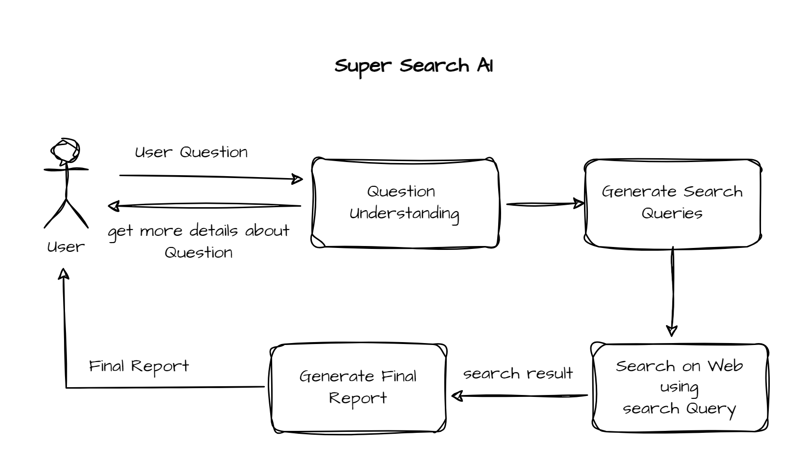

# SuperSearchAi
An AI-powered search engine that understand natural language questions and provide accurate answers.



## 🛠 Features
- AI-powered search 
- Natural language question understanding
- Accurate answers

## AI Providers
- OpenRouter
- Ollama

## Search Providers
- Tavily (Default search provider)

## 📋 Requirements
- Python 3.11

## 🚀 Quickstart

1- Fork and Clone repo
 - `git clone https://github.com/24-mohamedyehia/SuperSearchAi.git`

2- 📦 Install Python Using Miniconda
 - Download and install MiniConda from [here](https://www.anaconda.com/docs/getting-started/miniconda/main#quick-command-line-install)

3- Create a new environment using the following command:
```bash
$ conda create --name SuperSearchAi python=3.11 -y
```

4- Activate the environment:
```bash
$ conda activate SuperSearchAi
```

5- Install the required packages
```bash
$ pip install -r requirements.txt
```

6- Setup the environment variables
```bash
$ cp .env.example .env
```

7- Set your environment variables in the .env file. Like:
- OPEN_ROUTER_API_KEY value to use LLM
    - You can get your Open Router API key from [here](https://openrouter.ai/settings/keys).
- AGENTOPS_API_KEY value to monitor the agents
    - You can get your AgentOps API key from [here](https://agentops.com/).
- TVLY_SEARCH_API_KEY value to search the web
    - You can get your TVLY_SEARCH_API_KEY from [here](https://app.tavily.com/).

### 🚀 Run the application
```bash
$ python main.py
```
# Run Server
To run the FastAPI server, use the command:
```bash
uvicorn app:app --reload --port 8000
```

## 🛠 Technologies
- Python 3.11
- CrewAI
- AgentOps
- Tavily    

## 📜 License
This project is licensed under the Apache License 2.0. See the [LICENSE](./LICENSE) file for details.