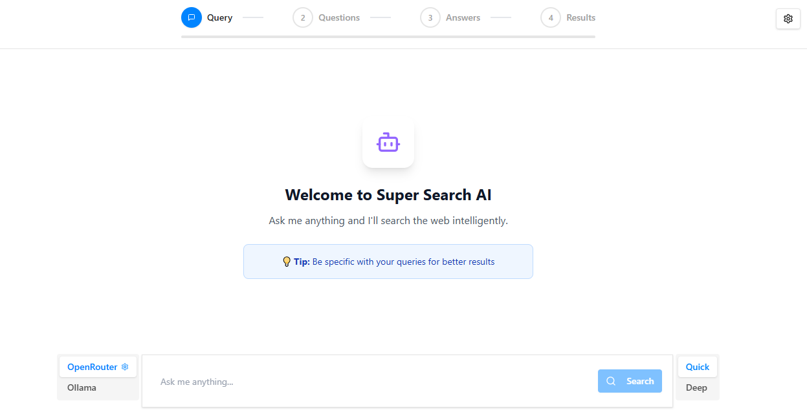

# SuperSearchAi
An AI-powered search engine that understand natural language questions and provide accurate answers.




## 🛠 Features
- AI-powered search 
- Natural language question understanding
- Accurate answers

## Providers Supported
- OpenRouter
- Ollama

## Search Providers Supported
- Tavily (Default search provider)
- Google (serper)

## 📋 Requirements
- Python 3.11

## 🚀 Quickstart

### Backend Setup

1- Fork and Clone repo
 - `git clone https://github.com/24-mohamedyehia/SuperSearchAi.git`

2- 📦 Install Python Using Miniconda
 - Download and install MiniConda from [here](https://www.anaconda.com/docs/getting-started/miniconda/main#quick-command-line-install)

3- Create a new environment using the following command:
```bash
$ conda create --name SuperSearchAi python=3.11 -y
```

4- Activate the environment:
```bash
$ conda activate SuperSearchAi
```

5- Install the required packages
```bash
$ pip install -r requirements.txt
```

6- Install the project in editable mode
This step is important to make internal imports work correctly
```bash
$ pip install -e .
```

7- Setup the environment variables
```bash
$ cp .env.example .env
```

8- Set your environment variables in the .env file. Like:
- AGENTOPS_API_KEY value to monitor the agents
    - You can get your AgentOps API key from [here](https://agentops.com/).
- TVLY_SEARCH_API_KEY value to search the web
    - You can get your TVLY_SEARCH_API_KEY from [here](https://app.tavily.com/).
- serper API key value to search the web
    - You can get your serper API key from [here](https://serper.dev/).

### Run Server
To run the FastAPI server, use the command:
```bash
uvicorn app:app --reload --port 8000
```

### Frontend Setup (Vite + React)

The UI lives in `frontend/`.

1- Install dependencies
```bash
cd frontend
npm install
```

2- Configure API base URL (optional if default is fine)
- Create `frontend/.env` and set:
```bash
VITE_API_URL=http://localhost:8000
```
If not set, the frontend defaults to `http://localhost:8000` as seen in `frontend/src/services/searchApi.ts`.

3- Run the dev server
```bash
npm run dev
```

### 📡 API Endpoints

### 1. Start Search Session
**POST** `/start/`
```json
{
  "query": "your search query",
  "LLM_PROVIDER": "your LLM provider",
  "LLM_API_KEY": "your LLM api key",
  "LLM_MODEL": "your LLM model",
  "LLM_BASE_URL": "your LLM base url"
}
```

### 2. Execute Search
**POST** `/search/`
```json
{
  "session_id": "uuid-from-start-endpoint",
  "search_mode": "quick",
  "query": "Your search query",
  "answers": [
    {
      "question_id": "1",
      "choice": "Your answer choice"
    }
  ]
}
```

### 3. Get Search Results
**GET** `results/?session_id=`

Returns comprehensive search results including:
- Search status (in_progress, completed, failed)
- Search results from web queries
- Generated AI report
- User details and query information

### 🗂️ Project Structure

```
SuperSearchAi/
├─ app.py                  # FastAPI app entrypoint
├─ requirements.txt        # Python deps
├─ setup.py                # Editable install configuration
├─ src/                    # Backend source
│  ├─ routes/              # FastAPI routers: base, start, search, results
│  ├─ controllers/         # Business logic
│  ├─ models/              # Pydantic models (e.g., StartRequest)
│  ├─ providers/           # Settings holder, provider configs
│  └─ helpers/             # utils, prompt loader, etc.
├─ frontend/               # Vite + React UI
│  └─ src/
│     ├─ assets/           # Project assets
│     ├─ components/       # UI components
│     ├─ hooks/            # React hooks
│     ├─ lib/              # React Router routes
│     ├─ services/         # API services
│     ├─ types/            # Typescript types
├─ public/                 # Project assets (e.g., supersearchai.png)
└─ .env.example            # Environment variable template
```

## 🛠 Technologies 
- Python 3.11
- CrewAI
- AgentOps
- Tavily 
- FastAPI
- Vite
- React
- Typescript
- TailwindCSS
- React Router   

## 📜 License
This project is licensed under the Apache License 2.0. See the [LICENSE](./LICENSE) file for details.

---


